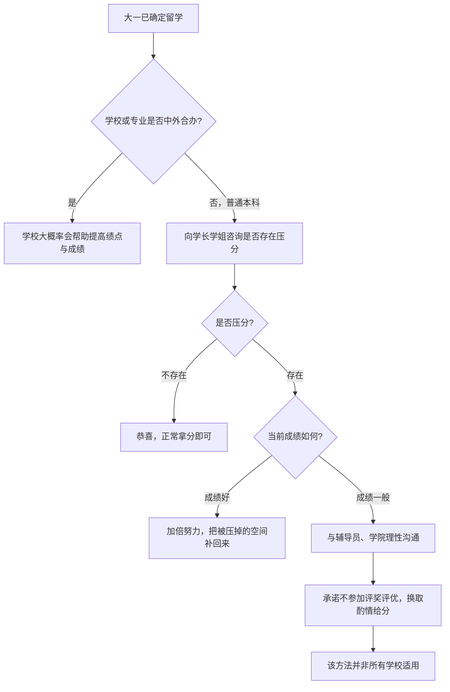

# 时间线与规划

关于提前一年该做什么、申请季关键节点，网上有很多贴文，用户可以自行搜索。本文重点不在于这里，本文将从普通大学四年规划出发，分别讲述大一确定留学、大二准备留学、大三准备留学、大四临时准备留学分别需要有哪些注意事项。

## 大一确定留学

大一就已经确定留学，第一步不是急着看申请季时间表，而是先摸清**自己学校会怎么对待成绩**。不同办学类型，绩点环境差很多。

### 1. 先判断学校 / 专业类型

- **学校本身是中外合办**（例如浙江的肯恩），或**专业是中外合办**（例如安徽的石溪相关专业）：这类项目通常面向出国，学校大概率会在绩点与成绩上提供相对宽松或支持性的环境。
- **普通本科**：不要默认学校会配合留学申请。先向学长学姐打听，本校、本专业有没有**压分**现象。

### 2. 普通本科：有没有压分，决定后面怎么走

- **不存在压分**：恭喜，正常上课、正常拿分即可。
- **存在压分**：需要认真对待。成绩已经不错的人，要加倍努力，把被压掉的空间补回来；成绩暂时一般的人，也不必直接放弃。

### 3. 存在压分时，成绩一般可以怎么沟通

一个可行、但**并非所有学校都适用**的做法：

- 与辅导员沟通，再与学院沟通；
- 明确表达留学意向，并承诺不参加各类评奖评优；
- 以此换取任课老师在给分上的酌情处理。

请与辅导员、学院领导**理性沟通**，争取自己的合理权益。这不是通用攻略，只是一条可以尝试的路径。

### 判断流程

## 大二准备留学

> 待补充

## 大三准备留学

> 待补充

## 大四临时准备留学

> 待补充
