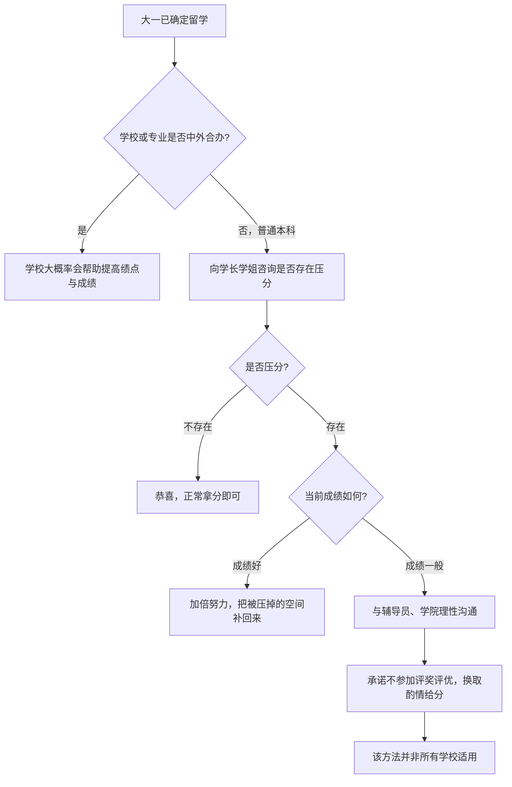
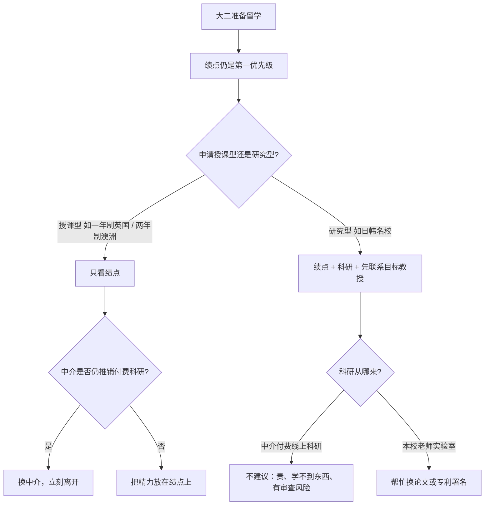
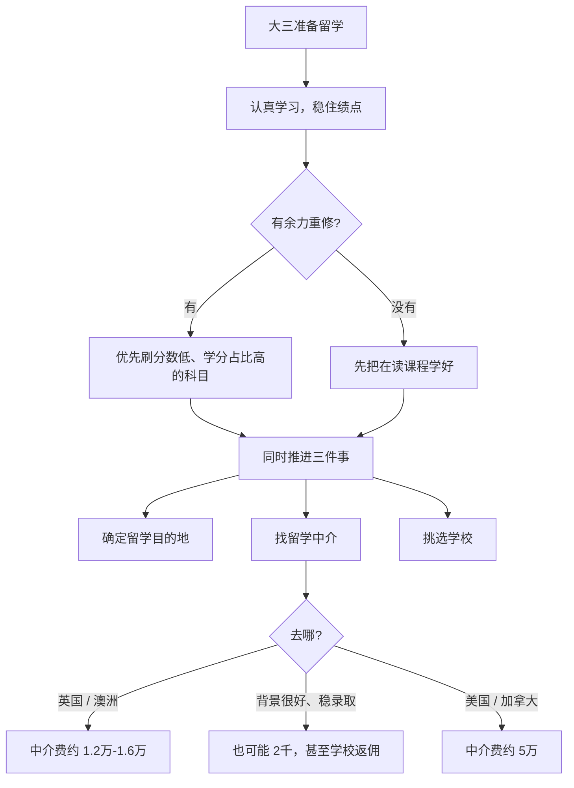
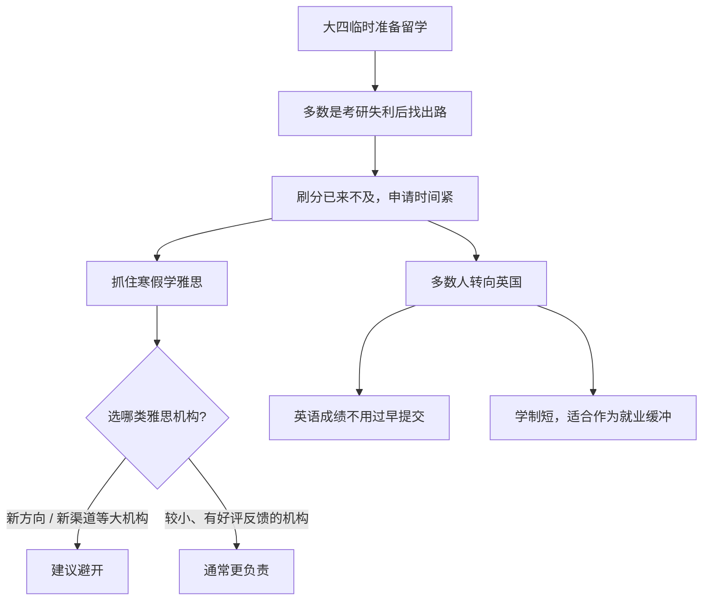

# 时间线与规划

关于提前一年该做什么、申请季关键节点，网上有很多贴文，用户可以自行搜索。本文重点不在于这里，本文将从普通大学四年规划出发，分别讲述大一确定留学、大二准备留学、大三准备留学、大四临时准备留学分别需要有哪些注意事项。

- [大一确定留学](#大一确定留学)
- [大二准备留学](#大二准备留学)
- [大三准备留学](#大三准备留学)
- [大四临时准备留学](#大四临时准备留学)

## 大一确定留学

大一就已经确定留学，第一步不是急着看申请季时间表，而是先摸清**自己学校会怎么对待成绩**。不同办学类型，绩点环境差很多。

### 1. 先判断学校 / 专业类型

- **学校本身是中外合办**（例如浙江的肯恩），或**专业是中外合办**（例如安徽的石溪相关专业）：这类项目通常面向出国，学校大概率会在绩点与成绩上提供相对宽松或支持性的环境。
- **普通本科**：不要默认学校会配合留学申请。先向学长学姐打听，本校、本学院、本专业有没有**压分**现象。

### 2. 普通本科：有没有压分，决定后面怎么走

- **不存在压分**：恭喜，正常上课、正常拿分即可。
- **存在压分**：需要认真对待。成绩已经不错的人，要加倍努力，把被压掉的空间补回来；成绩暂时一般的人，也不必直接放弃。

### 3. 存在压分时，成绩一般可以怎么沟通

一个可行、但**并非所有学校都适用**的做法：

- 与辅导员沟通，再与学院沟通；
- 明确表达留学意向，并承诺不参加各类评奖评优；
- 以此换取任课老师在给分上的酌情处理。

请与辅导员、学院领导**理性沟通**，争取自己的合理权益。这不是通用攻略，只是一条可以尝试的路径。

### 判断流程

## 大二准备留学

如果现在已经是大二，大一那条「放弃评奖评优换取高分」的窗口，多半已经来不及了，但**仍然值得一试**。大二通常是四年里课程最密的一年，必须为绩点加倍努力——**绩点是申请里最重要的部分**。

大二这一年，还要把目标路径想清楚：你准备申请的是**授课型硕士**，还是**研究型硕士**。两条路后面该做什么，完全不一样。

### 1. 先分清：授课型还是研究型

多数人走的是授课型，例如：

- 一年制英国硕士；
- 两年制澳洲硕士。

这两类都属于**授课型硕士**。日韩名校提供的，则多为**研究型硕士**，基本两年起步。

### 2. 授课型硕士：只看绩点

- 授课型硕士**只看绩点**。科研经历、实习经历都是锦上添花，甚至可有可无。
- 绩点不达标，履历再丰富也申请不到。
- 如果留学机构已经知道你申请的是授课型，却仍推荐你做**付费科研**：唯一该做的事就是换中介，能跑多远跑多远。

授课型面向就业。后期读博很难，甚至基本读不了。

### 3. 研究型硕士：绩点仍重要，科研要真做

研究型往往是为读博准备的，申请更难，毕业也更难。需要同时满足：

- 绩点达标；
- 有科研经历；
- 先与目标院校的目标教授达成一致，才有可能被录取。

即便走研究型，本人也**不建议**中介的付费科研路线。这类项目多为线上科研，费用常见 2 万到 4 万，学不到什么有用能力，还存在被目标院校审查询问的风险。

如果确实需要科研经历，更稳妥的做法是：在本校找关系较好的任课老师，进实验室帮忙，争取论文署名或专利署名。

### 判断流程

## 大三准备留学

到了大三，大一、大二那些小窍门已经完全来不及了。这一年需要的是**认认真真学习**。有余力的话，可以把分数低、但学分占比高的科目拿去重修刷分。

盯成绩的同时，还要把后面三件事推进起来：**确定留学目的地、找留学中介、挑选学校**。

### 1. 成绩：认真学，有余力再刷分

- 大一换分、大二分路径的窗口，到大三基本已经关掉。
- 先把课上好，把绩点稳住。
- 如果还有余力，优先重修「分数低、学分占比高」的科目，对总绩点更划算。

### 2. 同步推进：目的地、中介、选校

成绩不是大三唯一的任务。这一年要把申请方向落到具体国家 / 地区，并开始找中介、挑学校。三件事可以并行，不必等绩点完全定型再动手。

### 3. 中介费：仅供参考

以下以**华东、华中某省会**的行情为参考，不是报价，更不是全国均价：

- **英国 / 澳洲**：中介费大约 1.2 万到 1.6 万。
- **学校层次很好、绩点同样很好、基本稳录取**：中介费也可能只要 2 千，甚至出现学校返佣的情况。
- **美国 / 加拿大**：普遍更贵，中介费大约 5 万左右。

具体以你当地、当时的合同为准。

### 判断流程

## 大四临时准备留学

大四才临时准备出国的，多数是考研失利后想找一条出路。没有人愿意走到这一步，但继续读书确实能避免仓促进入就业市场。

这时候刷分已经没机会了，申请时间也很紧。能抓的，主要是语言考试和目的地选择。

### 1. 先认清现实

- 重修刷分基本来不及。
- 申请窗口短，材料、语言、选校要挤在同一段时间里做完。
- 目标不是把四年没做的事补全，而是在现有绩点上，尽快找到一条能走通的路。

### 2. 寒假是雅思最宝贵的时间

一定要抓住寒假。建议避开「新方向」「新渠道」这类大机构，转向规模较小、但有真实好评反馈的雅思机构。小机构通常更负责。

### 3. 多数人会转向英国

考研失利后转留学的学生，多数会选英国：

- 英语成绩不用过早提交；
- 读书时间较短；
- 适合作为本科毕业到找工作之间的缓冲。

### 判断流程

