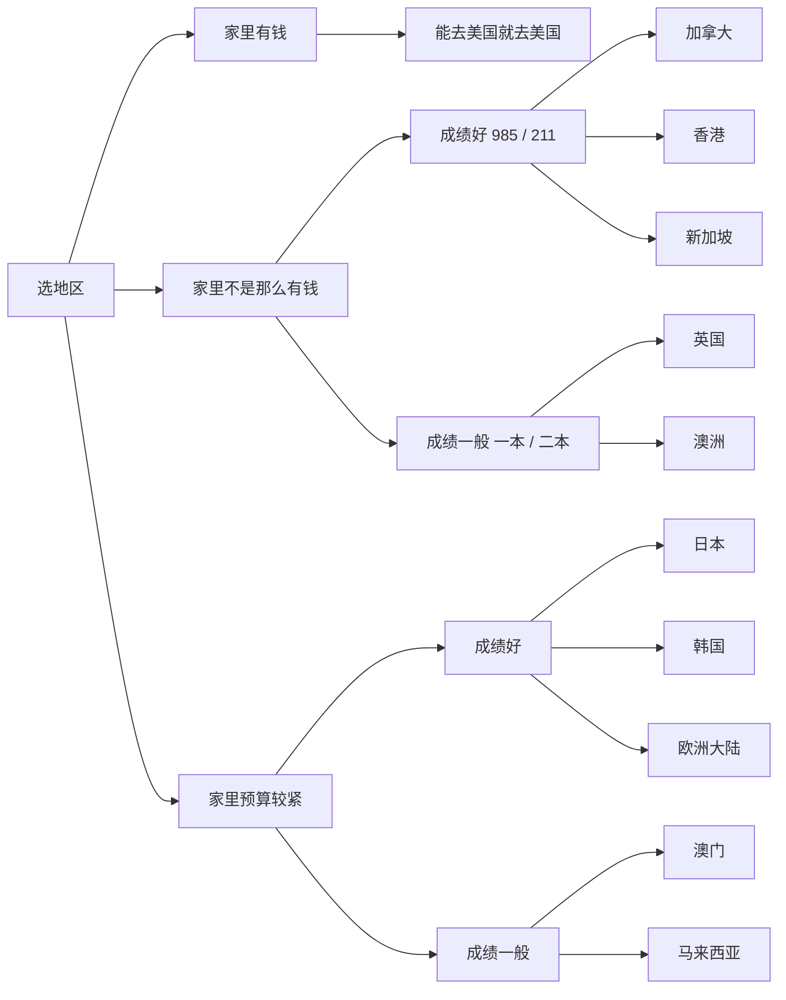

# 选地区

本页只谈留学目的地 / 地区怎么选，不展开具体院校名单和专业对比。

**以下为个人意见，仅供参考。** 家庭预算和成绩档次因人而异，最终以自身情况和目标院校要求为准。

## 怎么选

按家里预算先分流，再按成绩往下看。成绩档次按考研常见标准粗分：985 / 211 算成绩好，一本 / 二本算成绩一般。

家里有钱

能去美国就去美国。

家里不是那么有钱

先把美国排除掉，再按成绩选：

- **成绩好**（考研标准：985 / 211）：加拿大、香港、新加坡
- **成绩一般**（考研标准：一本 / 二本）：英国、澳洲

家里预算较紧

- **成绩好**：日本、韩国、欧洲大陆
- **成绩一般**：澳门、马来西亚

