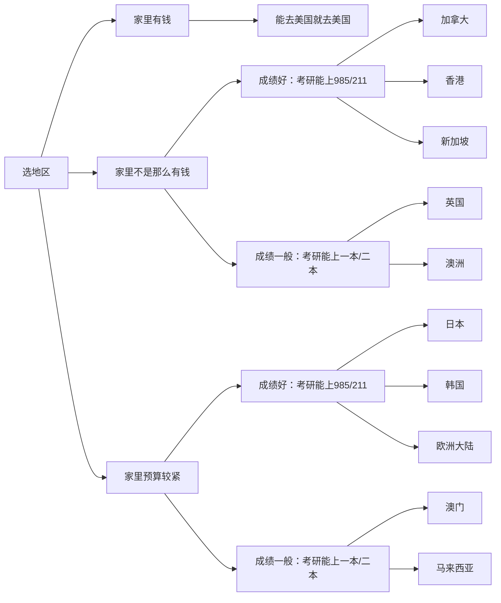

# 选地区

本页只谈留学目的地 / 地区怎么选，不展开具体院校名单和专业对比。

**以下为个人意见，仅供参考。** 这里只覆盖当前较热门的留学地区，并不全。家庭预算和成绩档次因人而异，最终以自身情况和目标院校要求为准。

## 怎么选

按家里预算先分流，再按成绩往下看。这里的成绩档次**不是看本科学校是不是 985 / 211**，而是估自己如果参加考研，大概能考上哪一档：能上 985 / 211 算成绩好，能上一本 / 二本算成绩一般。

```mermaid
flowchart LR
    A[选地区] --> B[家里有钱]
    A --> C[家里不是那么有钱]
    A --> D[家里预算较紧]
    B --> B1[能去美国就去美国]
    C --> C1[成绩好：考研能上985/211]
    C --> C2[成绩一般：考研能上一本/二本]
    C1 --> C11[加拿大]
    C1 --> C12[香港]
    C1 --> C13[新加坡]
    C2 --> C21[英国]
    C2 --> C22[澳洲]
    D --> D1[成绩好：考研能上985/211]
    D --> D2[成绩一般：考研能上一本/二本]
    D1 --> D11[日本]
    D1 --> D12[韩国]
    D1 --> D13[欧洲大陆]
    D2 --> D21[澳门]
    D2 --> D22[马来西亚]
```

家里有钱

能去美国就去美国。

家里不是那么有钱

先把美国排除掉，再按成绩选：

- **成绩好**（预计考研能上 985 / 211）：加拿大、香港、新加坡
- **成绩一般**（预计考研能上一本 / 二本）：英国、澳洲

家里预算较紧

- **成绩好**（预计考研能上 985 / 211）：日本、韩国、欧洲大陆
- **成绩一般**（预计考研能上一本 / 二本）：澳门、马来西亚

---

## 我的选择过程

当时考虑过五个地区：香港、加拿大、澳洲、新西兰，还有马来西亚。

- 香港：太难了，直接放弃。
- 加拿大：也难，申请费还高，不划算。
- 马来西亚：便宜，但回国认可度低，pass。
- 澳洲、新西兰：最后选了这两。**转专业友好**，对跨专业申请包容度高。

先保证"申得上"，再谈"学校好"。

## 各地区一句话

- 英国：一年制，**快进快出**；要 PS 和推荐信；回国认可度高。
- 美国：1.5–2 年，**最贵**；材料最全；学校多，选择面广。
- 澳洲：**申请最省事**，不要文书不要推荐信，有些免申请费；1–2 年。（DIY 完全搞得定，见 [踩坑](10-踩坑合集.md#pit-agent-au)；签证体检建议留中介。）
- 新西兰：同澳洲，学校少，竞争小。
- 香港：离家近，1 年制；要 PS 和推荐信；港前三难申。
- 新加坡：学校少，NUS / NTU 为主；门槛高。
- 爱尔兰：比英国便宜；要推荐信；小众。
- 加拿大：授课硕项目少，移民导向；材料因校而异。

## 三步走

1. **先看预算**：学费＋生活费×学制，直接砍掉一半选项。
2. **再看材料成本**：不想写文书 → 澳洲 / 新西兰；冲名校 → 英美港新。
3. **最后看去向**：回国看名气；想留下，看当地产业和工签。
